# 🏗️ Architecture Overview

This document provides a high-level overview of the system architecture, design patterns, and component interactions within the Hono.js CQRS User Service project.

## 🏛️ Architectural Style: Layered Architecture

The project employs a classic **Layered Architecture**, separating concerns into distinct layers. This promotes modularity, maintainability, and testability.

**Layers:**

1.  **🌐 Presentation Layer (`src/presentation`)**:
    *   **Responsibility:** Handles incoming HTTP requests, performs basic request validation/parsing, and translates requests into application-specific commands or queries. It also formats application responses back into HTTP responses.
    *   **Technology:** Hono.js framework.
    *   **Key Components:** `user.routes.ts`.
    *   **Interaction:** Interacts *only* with the Application Layer (specifically, the `UserService`).

2.  **⚙️ Application Layer (`src/application`)**:
    *   **Responsibility:** Contains the application's core use cases and business logic orchestration. It coordinates the domain objects and infrastructure services to fulfill requests initiated by the Presentation Layer. This layer implements the CQRS pattern.
    *   **Technology:** TypeScript.
    *   **Key Components:** `UserService`, Command Handlers (`CreateUserHandler`, etc.), Query Handlers (`ListUsersHandler`, etc.), Command/Query objects, `UserRepository` interface (Port).
    *   **Interaction:** Uses Domain Layer objects and interacts with the Infrastructure Layer through interfaces (ports).

3.  **🧠 Domain Layer (`src/domain`)**:
    *   **Responsibility:** Represents the core business concepts, entities, and rules. It should be independent of application and infrastructure concerns. In this simple example, it primarily defines the `User` entity.
    *   **Technology:** TypeScript.
    *   **Key Components:** `user.ts`.
    *   **Interaction:** Used by the Application Layer. Has no dependencies on other layers.

4.  **💾 Infrastructure Layer (`src/infrastructure`)**:
    *   **Responsibility:** Deals with external concerns like databases, external APIs, file systems, etc. It provides concrete implementations (Adapters) for interfaces defined in the Application Layer (Ports).
    *   **Technology:** TypeScript.
    *   **Key Components:** `InMemoryUserRepository` (implements `UserRepository`).
    *   **Interaction:** Implements interfaces defined by the Application Layer.

## ✨ Design Pattern: Command Query Responsibility Segregation (CQRS)

The Application Layer implements the CQRS pattern to separate operations that change state (Commands) from operations that read state (Queries).

*   **Commands (`src/application/command`)**: Encapsulate the intent to change the system state (e.g., `CreateUserCommand`, `UpdateUserCommand`). They are processed by dedicated **Command Handlers** which contain the logic to perform the change, often involving domain entities and repository writes. Commands typically do not return data, or only return minimal confirmation (like an ID).
*   **Queries (`src/application/query`)**: Encapsulate the intent to retrieve data (e.g., `ListUsersQuery`, `GetUserQuery`). They are processed by dedicated **Query Handlers** which directly fetch the required data, often bypassing complex domain logic for performance. Queries return Data Transfer Objects (DTOs) or simple data structures tailored for the specific read operation.

**Benefits:**

*   **Separation of Concerns:** Simplifies command and query logic independently.
*   **Scalability:** Read and write workloads can be scaled independently.
*   **Optimization:** Read models can be optimized specifically for querying performance.
*   **Flexibility:** Different persistence mechanisms could potentially be used for read and write sides.

## 🌊 Request Flow Examples

### Command Flow (Create User)

### Query Flow (List Users)

```plantuml
@startuml List Users Query Flow
!theme vibrant

actor Client
participant "🌐 Presentation\n(user.routes.ts)" as Pres #f9f
participant "⚙️ Application\n(UserService)" as AppSvc #ccf
participant "⚙️ Application\n(ListUsersHandler)" as QryH #ccf
participant "💾 Infrastructure\n(UserRepository)" as Repo #9cf

Client -> Pres ++ : GET /users
Pres -> AppSvc ++ : query(ListUsersQuery)
AppSvc -> QryH ++ : handle(query)
QryH -> Repo ++ : list() / getAll()
Repo --> QryH -- : List of Users
QryH --> AppSvc -- : List of Users
AppSvc --> Pres -- : List of Users
Pres --> Client -- : 200 OK (User List JSON)

@enduml
```

*(Note: The `UserService` in the current implementation has distinct `execute` for commands and `query` for queries, slightly differing from the diagram which shows a single entry point for simplicity. The core flow remains the same.)*