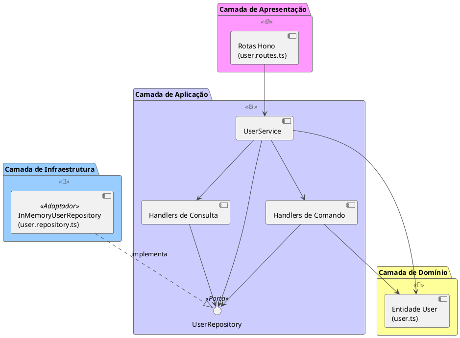
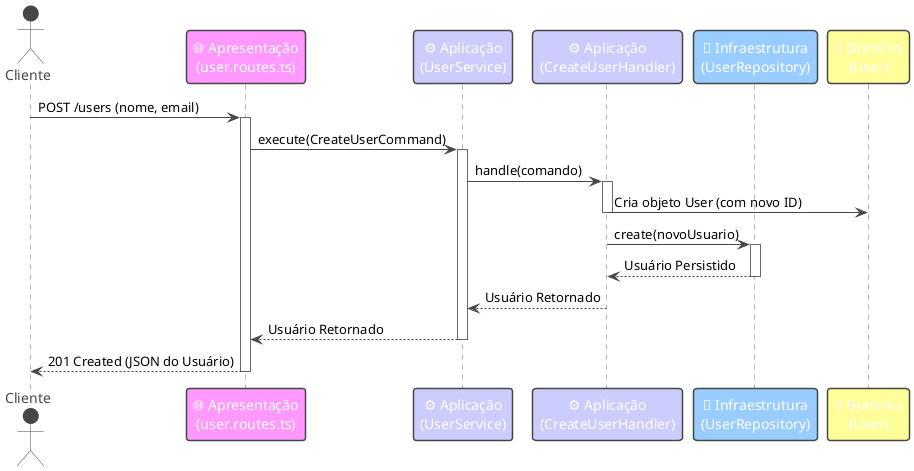
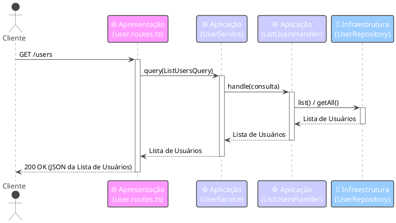

# 🏗️ Visão Geral da Arquitetura

Este documento fornece uma visão geral de alto nível da arquitetura do sistema, padrões de design e interações entre componentes dentro do projeto Hono.js CQRS User Service.

## 🏛️ Estilo Arquitetural: Arquitetura em Camadas

O projeto emprega uma clássica **Arquitetura em Camadas** (Layered Architecture), separando as responsabilidades em camadas distintas. Isso promove modularidade, manutenibilidade e testabilidade.

**Camadas:**

1.  **🌐 Camada de Apresentação (`src/presentation`)**:
    *   **Responsabilidade:** Lida com requisições HTTP de entrada, realiza validação/parsing básico da requisição e traduz as requisições em comandos ou consultas específicas da aplicação. Também formata as respostas da aplicação de volta em respostas HTTP.
    *   **Tecnologia:** Framework Hono.js.
    *   **Componentes Chave:** `user.routes.ts`.
    *   **Interação:** Interage *apenas* com a Camada de Aplicação (especificamente, o `UserService`).

2.  **⚙️ Camada de Aplicação (`src/application`)**:
    *   **Responsabilidade:** Contém os casos de uso principais da aplicação e a orquestração da lógica de negócios. Coordena os objetos de domínio e serviços de infraestrutura para atender às requisições iniciadas pela Camada de Apresentação. Esta camada implementa o padrão CQRS.
    *   **Tecnologia:** TypeScript.
    *   **Componentes Chave:** `UserService`, Handlers de Comando (`CreateUserHandler`, etc.), Handlers de Consulta (`ListUsersHandler`, etc.), objetos de Comando/Consulta, interface `UserRepository` (Porta).
    *   **Interação:** Usa objetos da Camada de Domínio e interage com a Camada de Infraestrutura através de interfaces (portas).

3.  **🧠 Camada de Domínio (`src/domain`)**:
    *   **Responsabilidade:** Representa os conceitos de negócio centrais, entidades e regras. Deve ser independente das preocupações de aplicação e infraestrutura. Neste exemplo simples, define primariamente a entidade `User`.
    *   **Tecnologia:** TypeScript.
    *   **Componentes Chave:** `user.ts`.
    *   **Interação:** Usada pela Camada de Aplicação. Não possui dependências de outras camadas.

4.  **💾 Camada de Infraestrutura (`src/infrastructure`)**:
    *   **Responsabilidade:** Lida com preocupações externas como bancos de dados, APIs externas, sistemas de arquivos, etc. Fornece implementações concretas (Adaptadores) para interfaces definidas na Camada de Aplicação (Portas).
    *   **Tecnologia:** TypeScript.
    *   **Componentes Chave:** `InMemoryUserRepository` (implementa `UserRepository`).
    *   **Interação:** Implementa interfaces definidas pela Camada de Aplicação.

## ✨ Padrão de Design: Command Query Responsibility Segregation (CQRS)

A Camada de Aplicação implementa o padrão CQRS para separar operações que alteram o estado (Comandos) de operações que leem o estado (Consultas).

*   **Comandos (`src/application/command`)**: Encapsulam a intenção de alterar o estado do sistema (ex: `CreateUserCommand`, `UpdateUserCommand`). São processados por **Handlers de Comando** dedicados que contêm a lógica para realizar a alteração, frequentemente envolvendo entidades de domínio e escritas no repositório. Comandos tipicamente não retornam dados, ou retornam apenas confirmação mínima (como um ID).
*   **Consultas (`src/application/query`)**: Encapsulam a intenção de recuperar dados (ex: `ListUsersQuery`, `GetUserQuery`). São processadas por **Handlers de Consulta** dedicados que buscam diretamente os dados necessários, muitas vezes contornando lógica de domínio complexa para performance. Consultas retornam Data Transfer Objects (DTOs) ou estruturas de dados simples adaptadas para a operação de leitura específica.

**Benefícios:**

*   **Separação de Responsabilidades:** Simplifica a lógica de comandos e consultas independentemente.
*   **Escalabilidade:** Cargas de trabalho de leitura e escrita podem ser escaladas independentemente.
*   **Otimização:** Modelos de leitura podem ser otimizados especificamente para performance de consulta.
*   **Flexibilidade:** Mecanismos de persistência diferentes poderiam potencialmente ser usados para os lados de leitura e escrita.

## 🌊 Exemplos de Fluxo de Requisição

### Fluxo de Comando (Criar Usuário)

### Fluxo de Consulta (Listar Usuários)

*(Nota: O `UserService` na implementação atual possui métodos distintos `execute` para comandos e `query` para consultas, diferindo ligeiramente do diagrama que mostra um único ponto de entrada por simplicidade. O fluxo central permanece o mesmo.)*